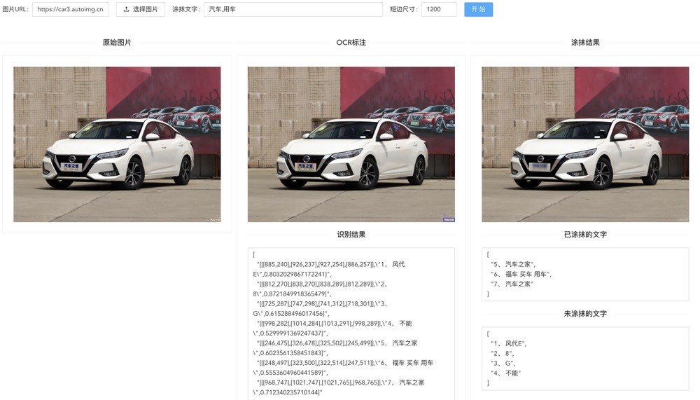

# 涂抹图片上的文字区域

## 项目说明

本项目chineseocr_web 基于 [chineseocr_lite](https://github.com/DayBreak-u/chineseocr_lite) 文字识别功能，去除了web无关的内容，增加了涂抹文字区域的功能。

## web界面

可以通过输入图片的url，或者上传本地图片的方式

### 原始图片


### ocr结果


### 涂抹结果


## docker 运行
```bash
# 拉取代码
git clone https://git.pc.com.cn/in-smart/chineseocr_web.git
# 进入目录
cd chineseocr_web
# build 镜像
docker build -t chineseocr_web .
# 运行
docker run --rm -d --name chineseocr_web -p 8080:8080 chineseocr_web
# 或者可以把工作目录映射到本地
docker run --rm -d --restart=always --name chineseocr_web -p 8080:8080 -v $(pwd):/data/project chineseocr_web
# 浏览器打开 http://localhost:8080/ 即可访问web界面
```

## 接口使用
### get http://localhost:8080/api/tr-run/
参数说明
* url : 在线的图片url
* keyword : 包含关键词的文字都会被涂抹，多个关键词以逗号分隔，如果为空则涂抹全部
* shortlen : 短边尺寸，文字识别的时候图片尺寸太小会影响识别准确度，如：960或1200
* 直接返回涂抹后的图片二进制数据

### post http://localhost:8080/api/tr-run/
参数说明
* url | img | file : 图片的输入支持三种形式，url: 在线图片地址，img: 图片文件的base64编码数据，file : 文件上传形式
* keyword : 包含关键词的文字都会被涂抹，多个关键词以逗号分隔，如果为空则涂抹全部
* shortlen : 短边尺寸，文字识别的时候图片尺寸太小会影响识别准确度，如：960或1200
* rt_origin : 是否返回原始图片的base64编码数据
* rt_ocr : 是否返回ocr识别标注图片的base64编码数据
* rt_mosaic : 是否返回文字区域涂抹后的图片的base64编码数据
返回json格式数据
```json
{
    "code": 200, 
    "msg":"message", 
    "data":{
        "origin_img":"base64编码的图片内容",
        "ocr_img":"base64编码的图片内容",
        "ocr_info":{},
        "mosaic_img":"base64编码的图片内容",
        "mosaic_info":{}
    }
}


```